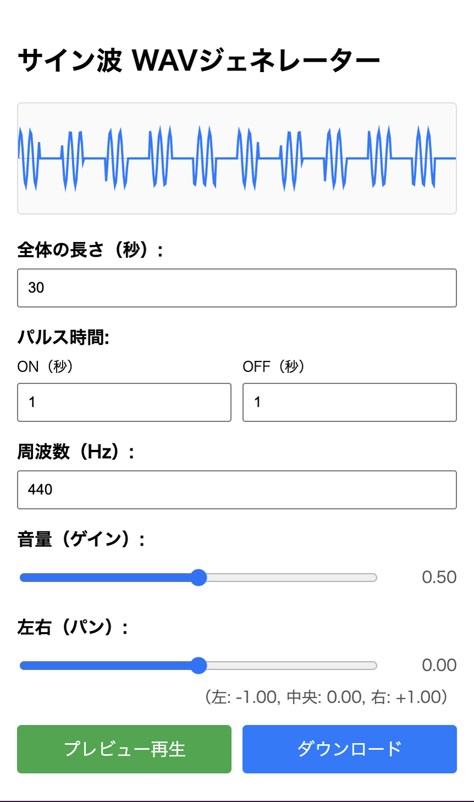

# 🔊 WAV Generator (サイン波パルス波形ジェネレーター)

[https://nekomimi-daimao.github.io/WavGenerator/](https://nekomimi-daimao.github.io/WavGenerator/)



このプロジェクトは、Webブラウザ上で動作する**サイン波のパルス波形（断続的な音）ジェネレーター**です。任意の周波数、ゲイン、パルス時間（ON/OFF時間）を設定し、その場でプレビュー再生し、最終的なWAVファイルをダウンロードできます。

---

## ✨ 機能 (Features)

* **パルス波形生成:** 音の鳴る時間（ON）と無音の時間（OFF）を秒単位で設定し、断続的なサイン波を生成します。
* **リアルタイムプレビュー:** 作成した波形をすぐにブラウザで再生して確認できます。
* **ビジュアルフィードバック:** 設定に基づいた波形パターンをCanvas上にリアルタイムで描画します。
* **パラメータ設定:**
    * **周波数 (Hz):** 音の高さを設定。
    * **ゲイン (Volume):** 音量を設定（スライダー）。
    * **パン (Pan):** 左右のステレオ位置を設定（スライダー）。
    * **全体の長さ:** 生成するWAVファイルの総再生時間。
* **WAVダウンロード:** 設定した全長・波形で高品質なWAVファイルを生成し、ダウンロードできます。

---

## 🚀 使い方 (How to Use)

本ツールはブラウザ上で完結するため、特別なソフトウェアのインストールは不要です。

1.  **アクセス:** 以下の公開URLにアクセスしてください。
    > [https://nekomimi-daimao.github.io/WavGenerator/](https://nekomimi-daimao.github.io/WavGenerator/)

2.  **設定調整:** 以下のパラメータを設定します。
    * 「ON（秒）」と「OFF（秒）」でパルスの間隔を設定。
    * 「周波数」「音量」「左右」を調整。
3.  **プレビュー:** **「プレビュー再生」**ボタンをクリックして、設定した音を確認します。
4.  **ダウンロード:** **「ダウンロード」**ボタンをクリックすると、設定した全長に基づいてWAVファイルが生成され、ダウンロードされます。

---

## 🛠️ 技術スタック (Technical Stack)

* **HTML / CSS:** ユーザーインターフェース
* **JavaScript (ES6+):** メインロジック
* **Web Audio API:**
    * リアルタイム再生: `AudioContext`
    * WAVファイル生成: `OfflineAudioContext` (レンダリング処理に使用)
* **Deno (開発・デプロイ):** 開発時のローカルサーバー、およびデプロイ環境で使用。

---

## 💻 ローカルでの実行 (Local Development)

このプロジェクトをローカル環境で実行し、開発や修正を行うための手順です。

#### 前提条件

* [Deno](https://deno.land/) がインストールされていること。

#### 手順

1.  リポジトリをクローンします。
    ```bash
    git clone https://github.com/nekomimi-daimao/WavGenerator.git
    cd WavGenerator
    ```
2.  開発サーバーを起動します。
    ```bash
    # ポート4410で起動
    deno run --allow-net --allow-read --watch serve.js
    ```
3.  ブラウザでアクセスします。
    ```
    http://localhost:4410/
    ```

---

Geminiで生成しました。
